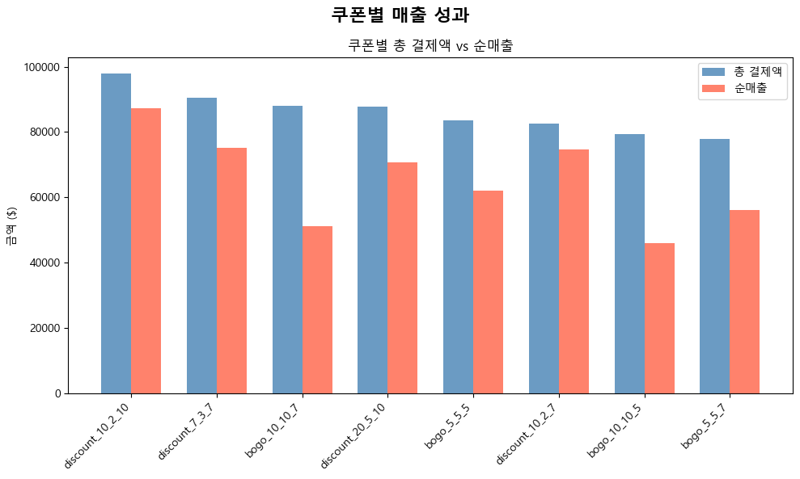
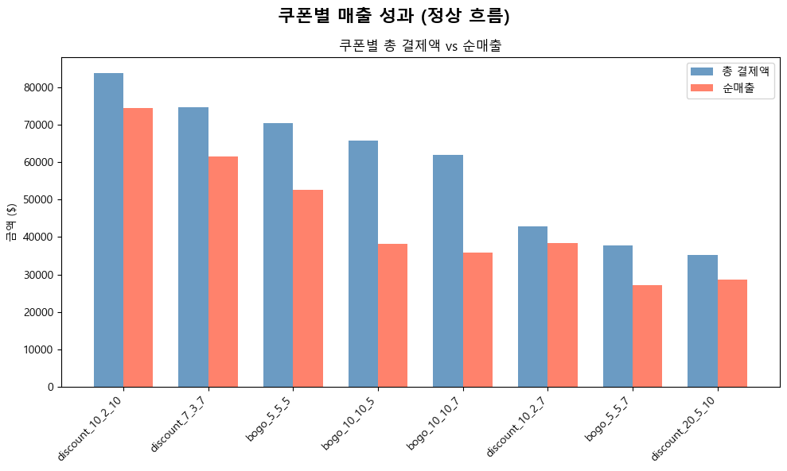

```python
import numpy as np
import pandas as pd
import matplotlib.pyplot as plt
import seaborn as sns
from scipy import stats
from IPython.display import display
import warnings

import ast

warnings.filterwarnings('ignore')

# 한글 폰트 설정
plt.rcParams['font.family'] = 'Malgun Gothic'

# 마이너스 기호 깨짐 방지
plt.rcParams['axes.unicode_minus'] = False

# 전역 시드 설정 (재현성을 위해)
np.random.seed(42)

print("="*60)
print("라이브러리 로드 완료!")
print("한글 폰트 설정 완료!")
print("="*60)
```

    ============================================================
    라이브러리 로드 완료!
    한글 폰트 설정 완료!
    ============================================================
    


```python
portfolio = pd.read_csv('../data/portfolio.csv')
profile = pd.read_csv('../data/profile.csv')
transcript = pd.read_csv('../data/transcript.csv')
```

---


```python
# 데이터 타입 date형식으로 변환
profile["became_member_on"] = pd.to_datetime(profile["became_member_on"], format="%Y%m%d")


# channels마다 파생변수 생성
portfolio['web'] = portfolio['channels'].astype(str).str.contains('web').astype(int)
portfolio['email'] = portfolio['channels'].astype(str).str.contains('email').astype(int)
portfolio['mobile'] = portfolio['channels'].astype(str).str.contains('mobile').astype(int)
portfolio['social'] = portfolio['channels'].astype(str).str.contains('social').astype(int)

# 기존 channels 컬럼 제거
portfolio = portfolio.drop('channels', axis=1)
```


```python
# 딕셔너리처럼 생긴 문자열을 진짜 딕셔너리로 변환
transcript['value'] = transcript['value'].apply(ast.literal_eval)

# 딕셔너리의 키 -> 새로운 컬럼
value_df = pd.DataFrame(transcript['value'].tolist())
transcript = pd.concat([transcript, value_df], axis=1)

# offer id를 offer_id로 컬럼명 통일
transcript['offer_id'] = transcript['offer_id'].fillna(transcript['offer id'])

# offer id 컬럼 제거
transcript = transcript.drop('offer id', axis=1)

# value 컬럼 제거
transcript = transcript.drop('value', axis=1)
```


```python
# profile의 필요없는 Unnamed:0 컬럼 제거
profile = profile.drop('Unnamed: 0', axis=1)

# transcript 기준으로 profile 데이터를 Left Join
merged_df = pd.merge(transcript, profile, left_on='person', right_on='id', how='left')

# 필요 없는 id 컬럼(person과 중복)은 버리기
merged_df = merged_df.drop(columns='id')
```


```python
# 결측치 처리

# gender의 결측치 'Unknown'으로 채우기 
merged_df['gender'] = merged_df['gender'].fillna('Unknown')


# age의 118을 결측치(NaN)로 바꿔주기 
merged_df['age'] = merged_df['age'].replace(118, np.nan)
# income은 이미 결측치(NaN) 상태
```


```python
# portfolio 테이블도 병합

# portfolio 테이블의 필요없는 인덱스 컬럼 제거
portfolio = portfolio.drop('Unnamed: 0', axis=1)

all_merge_df = pd.merge(
    merged_df,
    portfolio,
    left_on='offer_id',
    right_on='id',
    how='left'
)

all_merge_df = all_merge_df.drop(columns='id')

# reward 컬럼명 변경(명확하게)
all_merge_df = all_merge_df.rename(columns={
    "reward_x": "transcript_reward",
    "reward_y": "portfolio_reward"
})
```


```python
# offer_id 이름 변경 (쿠폰명_difficulty_reward_duration)
portfolio['offer_name'] = (
    portfolio['offer_type'] + '_' + 
    portfolio['difficulty'].astype(str) + '_' + 
    portfolio['reward'].astype(str) + '_' + 
    portfolio['duration'].astype(str)
)
# id : key, offer_name : value
offer_name_dict = portfolio.set_index('id')['offer_name'].to_dict()
all_merge_df['offer_id'] = all_merge_df['offer_id'].map(offer_name_dict)


# 사람(person)별로 먼저 묶고, 그 안에서 시간(time) 순서대로 오름차순 정렬
all_merge_df = all_merge_df.sort_values(by=['person', 'time', 'Unnamed: 0']) # - Unnamed: 0 순서 추가
```


```python
# 무엇을 위해 하는 코드인가? -> informational이 아닌 completed와 amount 경우만 선택하는 과정

# 조건 1: 쿠폰 타입이 bogo 이거나(in) discount 인 것
cond_offers = all_merge_df['offer_type'].isin(['bogo', 'discount'])

# 조건 2: 이벤트 종류가 transaction(결제) 인 것
cond_transactions = all_merge_df['event'] == 'transaction'

# 위 두 조건 중 하나라도 만족하는(|) 데이터만 쏙 뽑아서 덮어씌우기
target_df = all_merge_df[cond_offers | cond_transactions].copy()

# 잘 걸러졌는지 눈으로 확인해보기
print(target_df['offer_type'].value_counts(dropna=False))
print(target_df['event'].value_counts(dropna=False))
display(target_df.head())
display(target_df.shape)
```

    offer_type
    NaN         138953
    bogo         71617
    discount     69898
    Name: count, dtype: int64
    event
    transaction        138953
    offer received      61042
    offer viewed        46894
    offer completed     33579
    Name: count, dtype: int64
    


<div>
<style scoped>
    .dataframe tbody tr th:only-of-type {
        vertical-align: middle;
    }

    .dataframe tbody tr th {
        vertical-align: top;
    }

    .dataframe thead th {
        text-align: right;
    }
</style>
<table border="1" class="dataframe">
  <thead>
    <tr style="text-align: right;">
      <th></th>
      <th>Unnamed: 0</th>
      <th>person</th>
      <th>event</th>
      <th>time</th>
      <th>amount</th>
      <th>offer_id</th>
      <th>transcript_reward</th>
      <th>gender</th>
      <th>age</th>
      <th>became_member_on</th>
      <th>income</th>
      <th>portfolio_reward</th>
      <th>difficulty</th>
      <th>duration</th>
      <th>offer_type</th>
      <th>web</th>
      <th>email</th>
      <th>mobile</th>
      <th>social</th>
    </tr>
  </thead>
  <tbody>
    <tr>
      <th>89291</th>
      <td>89291</td>
      <td>0009655768c64bdeb2e877511632db8f</td>
      <td>transaction</td>
      <td>228</td>
      <td>22.16</td>
      <td>NaN</td>
      <td>NaN</td>
      <td>M</td>
      <td>33.0</td>
      <td>2017-04-21</td>
      <td>72000.0</td>
      <td>NaN</td>
      <td>NaN</td>
      <td>NaN</td>
      <td>NaN</td>
      <td>NaN</td>
      <td>NaN</td>
      <td>NaN</td>
      <td>NaN</td>
    </tr>
    <tr>
      <th>153401</th>
      <td>153401</td>
      <td>0009655768c64bdeb2e877511632db8f</td>
      <td>offer received</td>
      <td>408</td>
      <td>NaN</td>
      <td>bogo_5_5_5</td>
      <td>NaN</td>
      <td>M</td>
      <td>33.0</td>
      <td>2017-04-21</td>
      <td>72000.0</td>
      <td>5.0</td>
      <td>5.0</td>
      <td>5.0</td>
      <td>bogo</td>
      <td>1.0</td>
      <td>1.0</td>
      <td>1.0</td>
      <td>1.0</td>
    </tr>
    <tr>
      <th>168412</th>
      <td>168412</td>
      <td>0009655768c64bdeb2e877511632db8f</td>
      <td>transaction</td>
      <td>414</td>
      <td>8.57</td>
      <td>NaN</td>
      <td>NaN</td>
      <td>M</td>
      <td>33.0</td>
      <td>2017-04-21</td>
      <td>72000.0</td>
      <td>NaN</td>
      <td>NaN</td>
      <td>NaN</td>
      <td>NaN</td>
      <td>NaN</td>
      <td>NaN</td>
      <td>NaN</td>
      <td>NaN</td>
    </tr>
    <tr>
      <th>168413</th>
      <td>168413</td>
      <td>0009655768c64bdeb2e877511632db8f</td>
      <td>offer completed</td>
      <td>414</td>
      <td>NaN</td>
      <td>bogo_5_5_5</td>
      <td>5.0</td>
      <td>M</td>
      <td>33.0</td>
      <td>2017-04-21</td>
      <td>72000.0</td>
      <td>5.0</td>
      <td>5.0</td>
      <td>5.0</td>
      <td>bogo</td>
      <td>1.0</td>
      <td>1.0</td>
      <td>1.0</td>
      <td>1.0</td>
    </tr>
    <tr>
      <th>187554</th>
      <td>187554</td>
      <td>0009655768c64bdeb2e877511632db8f</td>
      <td>offer viewed</td>
      <td>456</td>
      <td>NaN</td>
      <td>bogo_5_5_5</td>
      <td>NaN</td>
      <td>M</td>
      <td>33.0</td>
      <td>2017-04-21</td>
      <td>72000.0</td>
      <td>5.0</td>
      <td>5.0</td>
      <td>5.0</td>
      <td>bogo</td>
      <td>1.0</td>
      <td>1.0</td>
      <td>1.0</td>
      <td>1.0</td>
    </tr>
  </tbody>
</table>
</div>


    (280468, 19)


```python
# person당 offer_id를 하나의 행으로 설정하여, 흩어진 고객 행동의 순서를 보기 편하게 해주는 "피벗테이블 생성 코드"

# 1. 피벗을 돌릴 '쿠폰 이력서' 데이터만 빼내기
offers_df = target_df[target_df['event'] != 'transaction'].copy()

# 2. 안전한 금고에 보관할 '순수 영수증' 데이터만 빼내기
transactions_df = target_df[target_df['event'] == 'transaction'].copy()

print(f"피벗할 쿠폰 데이터: {len(offers_df)} 줄")
print(f"금고에 보관한 영수증: {len(transactions_df)} 줄")
```

    피벗할 쿠폰 데이터: 141515 줄
    금고에 보관한 영수증: 138953 줄
    


```python
# 1. 시간 순서대로 예쁘게 줄 세우기
offers_df = offers_df.sort_values(['person', 'offer_id', 'time'])

# 2. 'received' 이벤트가 등장할 때마다 1, 아니면 0인 깃발(Flag) 만들기
offers_df['is_received'] = (offers_df['event'] == 'offer received').astype(int)

# 3. 사람과 쿠폰 단위로 묶어서, 깃발을 누적해서 더하기 (Cumsum)
offers_df['offer_cycle'] = offers_df.groupby(['person', 'offer_id'])['is_received'].cumsum()

# 4. 피벗 돌리기
pivot_df = offers_df.pivot_table(
    index=['person', 'offer_id', 'offer_cycle'],
    columns='event',
    values='time',
    aggfunc='min'
).reset_index()

pivot_df.columns.name = None
pivot_df = pivot_df[['person', 'offer_id', 'offer_cycle', 'offer received', 'offer viewed', 'offer completed']]

# reward 따로 뽑아서 merge
reward_df = offers_df[offers_df['event'] == 'offer completed'][['person', 'offer_id', 'offer_cycle', 'transcript_reward']]
pivot_df = pivot_df.merge(reward_df, on=['person', 'offer_id', 'offer_cycle'], how='left')

# ✅ portfolio 정보 붙이기
pivot_df = pivot_df.merge(
    portfolio[['offer_name', 'offer_type', 'difficulty', 'reward', 'duration', 'web', 'email', 'mobile', 'social']],
    left_on='offer_id',
    right_on='offer_name',
    how='left'
).drop(columns='offer_name')

# ✅ profile 정보 붙이기
pivot_df = pivot_df.merge(
    profile[['id', 'gender', 'age', 'became_member_on', 'income']],
    left_on='person',
    right_on='id',
    how='left'
).drop(columns='id')

display(pivot_df.head())
display(pivot_df.shape)
```


<div>
<style scoped>
    .dataframe tbody tr th:only-of-type {
        vertical-align: middle;
    }

    .dataframe tbody tr th {
        vertical-align: top;
    }

    .dataframe thead th {
        text-align: right;
    }
</style>
<table border="1" class="dataframe">
  <thead>
    <tr style="text-align: right;">
      <th></th>
      <th>person</th>
      <th>offer_id</th>
      <th>offer_cycle</th>
      <th>offer received</th>
      <th>offer viewed</th>
      <th>offer completed</th>
      <th>transcript_reward</th>
      <th>offer_type</th>
      <th>difficulty</th>
      <th>reward</th>
      <th>duration</th>
      <th>web</th>
      <th>email</th>
      <th>mobile</th>
      <th>social</th>
      <th>gender</th>
      <th>age</th>
      <th>became_member_on</th>
      <th>income</th>
    </tr>
  </thead>
  <tbody>
    <tr>
      <th>0</th>
      <td>0009655768c64bdeb2e877511632db8f</td>
      <td>bogo_5_5_5</td>
      <td>1</td>
      <td>408.0</td>
      <td>456.0</td>
      <td>414.0</td>
      <td>5.0</td>
      <td>bogo</td>
      <td>5</td>
      <td>5</td>
      <td>5</td>
      <td>1</td>
      <td>1</td>
      <td>1</td>
      <td>1</td>
      <td>M</td>
      <td>33</td>
      <td>2017-04-21</td>
      <td>72000.0</td>
    </tr>
    <tr>
      <th>1</th>
      <td>0009655768c64bdeb2e877511632db8f</td>
      <td>discount_10_2_10</td>
      <td>1</td>
      <td>504.0</td>
      <td>540.0</td>
      <td>528.0</td>
      <td>2.0</td>
      <td>discount</td>
      <td>10</td>
      <td>2</td>
      <td>10</td>
      <td>1</td>
      <td>1</td>
      <td>1</td>
      <td>1</td>
      <td>M</td>
      <td>33</td>
      <td>2017-04-21</td>
      <td>72000.0</td>
    </tr>
    <tr>
      <th>2</th>
      <td>0009655768c64bdeb2e877511632db8f</td>
      <td>discount_10_2_7</td>
      <td>1</td>
      <td>576.0</td>
      <td>NaN</td>
      <td>576.0</td>
      <td>2.0</td>
      <td>discount</td>
      <td>10</td>
      <td>2</td>
      <td>7</td>
      <td>1</td>
      <td>1</td>
      <td>1</td>
      <td>0</td>
      <td>M</td>
      <td>33</td>
      <td>2017-04-21</td>
      <td>72000.0</td>
    </tr>
    <tr>
      <th>3</th>
      <td>00116118485d4dfda04fdbaba9a87b5c</td>
      <td>bogo_5_5_5</td>
      <td>1</td>
      <td>168.0</td>
      <td>216.0</td>
      <td>NaN</td>
      <td>NaN</td>
      <td>bogo</td>
      <td>5</td>
      <td>5</td>
      <td>5</td>
      <td>1</td>
      <td>1</td>
      <td>1</td>
      <td>1</td>
      <td>NaN</td>
      <td>118</td>
      <td>2018-04-25</td>
      <td>NaN</td>
    </tr>
    <tr>
      <th>4</th>
      <td>00116118485d4dfda04fdbaba9a87b5c</td>
      <td>bogo_5_5_5</td>
      <td>2</td>
      <td>576.0</td>
      <td>630.0</td>
      <td>NaN</td>
      <td>NaN</td>
      <td>bogo</td>
      <td>5</td>
      <td>5</td>
      <td>5</td>
      <td>1</td>
      <td>1</td>
      <td>1</td>
      <td>1</td>
      <td>NaN</td>
      <td>118</td>
      <td>2018-04-25</td>
      <td>NaN</td>
    </tr>
  </tbody>
</table>
</div>


    (61520, 19)


```python
# 1. 원본에서 offer_id와 offer_type 짝꿍 사전 만들기
offer_dict = offers_df[['offer_id', 'offer_type']].drop_duplicates().set_index('offer_id')['offer_type'].to_dict()

# 2. 피벗 테이블의 offer_id를 보고, 임시로 쿠폰 타입(bogo, discount)을 가져오기
temp_offer_type = pivot_df['offer_id'].map(offer_dict)

# 3. [핵심] 기존 숫자였던 'offer_cycle' 컬럼 위에 곧바로 덮어쓰기! 
pivot_df['offer_cycle'] = temp_offer_type.str.capitalize() + '_' + pivot_df['offer_cycle'].astype(str)

```


```python
# 피벗테이블에 amount 붙이기

# 1. 금고(transactions_df)에서 영수증 알맹이만 꺼내기
transactions_df = transactions_df[['person', 'time', 'amount']]

# 2. 피벗 테이블(pivot_df)에 영수증(receipts) 1:1 도킹하기!
final_df = pivot_df.merge(
    transactions_df,
    left_on=['person', 'offer completed'],
    right_on=['person', 'time'],
    how='left'
)

# 3. 도킹 끝나고 쓸모없어진 'time' 기둥 버리기
final_df = final_df.drop(columns=['time'])

display(final_df.head())
display(final_df.shape)

```


<div>
<style scoped>
    .dataframe tbody tr th:only-of-type {
        vertical-align: middle;
    }

    .dataframe tbody tr th {
        vertical-align: top;
    }

    .dataframe thead th {
        text-align: right;
    }
</style>
<table border="1" class="dataframe">
  <thead>
    <tr style="text-align: right;">
      <th></th>
      <th>person</th>
      <th>offer_id</th>
      <th>offer_cycle</th>
      <th>offer received</th>
      <th>offer viewed</th>
      <th>offer completed</th>
      <th>transcript_reward</th>
      <th>offer_type</th>
      <th>difficulty</th>
      <th>reward</th>
      <th>duration</th>
      <th>web</th>
      <th>email</th>
      <th>mobile</th>
      <th>social</th>
      <th>gender</th>
      <th>age</th>
      <th>became_member_on</th>
      <th>income</th>
      <th>amount</th>
    </tr>
  </thead>
  <tbody>
    <tr>
      <th>0</th>
      <td>0009655768c64bdeb2e877511632db8f</td>
      <td>bogo_5_5_5</td>
      <td>Bogo_1</td>
      <td>408.0</td>
      <td>456.0</td>
      <td>414.0</td>
      <td>5.0</td>
      <td>bogo</td>
      <td>5</td>
      <td>5</td>
      <td>5</td>
      <td>1</td>
      <td>1</td>
      <td>1</td>
      <td>1</td>
      <td>M</td>
      <td>33</td>
      <td>2017-04-21</td>
      <td>72000.0</td>
      <td>8.57</td>
    </tr>
    <tr>
      <th>1</th>
      <td>0009655768c64bdeb2e877511632db8f</td>
      <td>discount_10_2_10</td>
      <td>Discount_1</td>
      <td>504.0</td>
      <td>540.0</td>
      <td>528.0</td>
      <td>2.0</td>
      <td>discount</td>
      <td>10</td>
      <td>2</td>
      <td>10</td>
      <td>1</td>
      <td>1</td>
      <td>1</td>
      <td>1</td>
      <td>M</td>
      <td>33</td>
      <td>2017-04-21</td>
      <td>72000.0</td>
      <td>14.11</td>
    </tr>
    <tr>
      <th>2</th>
      <td>0009655768c64bdeb2e877511632db8f</td>
      <td>discount_10_2_7</td>
      <td>Discount_1</td>
      <td>576.0</td>
      <td>NaN</td>
      <td>576.0</td>
      <td>2.0</td>
      <td>discount</td>
      <td>10</td>
      <td>2</td>
      <td>7</td>
      <td>1</td>
      <td>1</td>
      <td>1</td>
      <td>0</td>
      <td>M</td>
      <td>33</td>
      <td>2017-04-21</td>
      <td>72000.0</td>
      <td>10.27</td>
    </tr>
    <tr>
      <th>3</th>
      <td>00116118485d4dfda04fdbaba9a87b5c</td>
      <td>bogo_5_5_5</td>
      <td>Bogo_1</td>
      <td>168.0</td>
      <td>216.0</td>
      <td>NaN</td>
      <td>NaN</td>
      <td>bogo</td>
      <td>5</td>
      <td>5</td>
      <td>5</td>
      <td>1</td>
      <td>1</td>
      <td>1</td>
      <td>1</td>
      <td>NaN</td>
      <td>118</td>
      <td>2018-04-25</td>
      <td>NaN</td>
      <td>NaN</td>
    </tr>
    <tr>
      <th>4</th>
      <td>00116118485d4dfda04fdbaba9a87b5c</td>
      <td>bogo_5_5_5</td>
      <td>Bogo_2</td>
      <td>576.0</td>
      <td>630.0</td>
      <td>NaN</td>
      <td>NaN</td>
      <td>bogo</td>
      <td>5</td>
      <td>5</td>
      <td>5</td>
      <td>1</td>
      <td>1</td>
      <td>1</td>
      <td>1</td>
      <td>NaN</td>
      <td>118</td>
      <td>2018-04-25</td>
      <td>NaN</td>
      <td>NaN</td>
    </tr>
  </tbody>
</table>
</div>


    (61520, 20)


```python
final_df.to_csv('../data/final_df.csv', index=False)
```

---

# xxx


```python
amount_by_offer = (
    final_df[final_df['amount'].notna()]
    .groupby('offer_id')
    .agg(
        total_amount=('amount', 'sum'),
        total_reward=('transcript_reward', 'sum')
    )
    .reset_index()
)

# 실제 매출 = amount - reward
amount_by_offer['net_revenue'] = amount_by_offer['total_amount'] - amount_by_offer['total_reward']
amount_by_offer = amount_by_offer.sort_values('total_amount', ascending=False)

# 총합 행 추가
total_row = pd.DataFrame([{
    'offer_id': '합계',
    'total_amount': amount_by_offer['total_amount'].sum(),
    'total_reward': amount_by_offer['total_reward'].sum(),
    'net_revenue': amount_by_offer['net_revenue'].sum()
}])
amount_by_offer = pd.concat([amount_by_offer, total_row], ignore_index=True)

display(amount_by_offer)
```


<div>
<style scoped>
    .dataframe tbody tr th:only-of-type {
        vertical-align: middle;
    }

    .dataframe tbody tr th {
        vertical-align: top;
    }

    .dataframe thead th {
        text-align: right;
    }
</style>
<table border="1" class="dataframe">
  <thead>
    <tr style="text-align: right;">
      <th></th>
      <th>offer_id</th>
      <th>total_amount</th>
      <th>total_reward</th>
      <th>net_revenue</th>
    </tr>
  </thead>
  <tbody>
    <tr>
      <th>0</th>
      <td>discount_10_2_10</td>
      <td>97883.54</td>
      <td>10634.0</td>
      <td>87249.54</td>
    </tr>
    <tr>
      <th>1</th>
      <td>discount_7_3_7</td>
      <td>90530.90</td>
      <td>15468.0</td>
      <td>75062.90</td>
    </tr>
    <tr>
      <th>2</th>
      <td>bogo_10_10_7</td>
      <td>88106.63</td>
      <td>36880.0</td>
      <td>51226.63</td>
    </tr>
    <tr>
      <th>3</th>
      <td>discount_20_5_10</td>
      <td>87900.50</td>
      <td>17100.0</td>
      <td>70800.50</td>
    </tr>
    <tr>
      <th>4</th>
      <td>bogo_5_5_5</td>
      <td>83592.17</td>
      <td>21480.0</td>
      <td>62112.17</td>
    </tr>
    <tr>
      <th>5</th>
      <td>discount_10_2_7</td>
      <td>82671.14</td>
      <td>8034.0</td>
      <td>74637.14</td>
    </tr>
    <tr>
      <th>6</th>
      <td>bogo_10_10_5</td>
      <td>79283.59</td>
      <td>33310.0</td>
      <td>45973.59</td>
    </tr>
    <tr>
      <th>7</th>
      <td>bogo_5_5_7</td>
      <td>77911.04</td>
      <td>21770.0</td>
      <td>56141.04</td>
    </tr>
    <tr>
      <th>8</th>
      <td>합계</td>
      <td>687879.51</td>
      <td>164676.0</td>
      <td>523203.51</td>
    </tr>
  </tbody>
</table>
</div>


```python
# # 합계 행 제외하고 시각화
# plot_df = amount_by_offer[amount_by_offer['offer_id'] != '합계'].copy()

# fig, axes = plt.subplots(1, 2, figsize=(16, 6))
# fig.suptitle('쿠폰별 매출 성과', fontsize=16, fontweight='bold')

# x = range(len(plot_df))
# width = 0.35

# # 왼쪽: total_amount vs net_revenue 비교 막대그래프
# axes[0].bar([i - width/2 for i in x], plot_df['total_amount'], width, label='총 결제액', color='steelblue', alpha=0.8)
# axes[0].bar([i + width/2 for i in x], plot_df['net_revenue'], width, label='순매출', color='tomato', alpha=0.8)
# axes[0].set_title('쿠폰별 총 결제액 vs 순매출')
# axes[0].set_xticks(x)
# axes[0].set_xticklabels(plot_df['offer_id'], rotation=45, ha='right')
# axes[0].set_ylabel('금액 ($)')
# axes[0].legend()

# # 오른쪽: total_reward (리워드 비용) 막대그래프
# axes[1].bar(x, plot_df['total_reward'], color='orange', alpha=0.8)
# axes[1].set_title('쿠폰별 리워드 지급 비용')
# axes[1].set_xticks(x)
# axes[1].set_xticklabels(plot_df['offer_id'], rotation=45, ha='right')
# axes[1].set_ylabel('리워드 비용 ($)')

# plt.tight_layout()
# plt.show()
```


```python
plot_df = amount_by_offer[amount_by_offer['offer_id'] != '합계'].copy()

fig, ax = plt.subplots(1, 1, figsize=(10, 6))
fig.suptitle('쿠폰별 매출 성과', fontsize=16, fontweight='bold')

x = range(len(plot_df))
width = 0.35

ax.bar([i - width/2 for i in x], plot_df['total_amount'], width, label='총 결제액', color='steelblue', alpha=0.8)
ax.bar([i + width/2 for i in x], plot_df['net_revenue'], width, label='순매출', color='tomato', alpha=0.8)
ax.set_title('쿠폰별 총 결제액 vs 순매출')
ax.set_xticks(x)
ax.set_xticklabels(plot_df['offer_id'], rotation=45, ha='right')
ax.set_ylabel('금액 ($)')
ax.legend()

plt.tight_layout()
plt.show()
```


    

    


---

# 정상 흐름


```python
# 정상 흐름 필터링: received <= viewed <= completed (모두 존재해야 함)
normal_flow_df = final_df[
    final_df['offer received'].notna() &
    final_df['offer viewed'].notna() &
    final_df['offer completed'].notna() &
    (final_df['offer received'] <= final_df['offer viewed']) &
    (final_df['offer viewed'] <= final_df['offer completed'])
].copy()

display(normal_flow_df.head())
display(normal_flow_df.shape)
```


<div>
<style scoped>
    .dataframe tbody tr th:only-of-type {
        vertical-align: middle;
    }

    .dataframe tbody tr th {
        vertical-align: top;
    }

    .dataframe thead th {
        text-align: right;
    }
</style>
<table border="1" class="dataframe">
  <thead>
    <tr style="text-align: right;">
      <th></th>
      <th>person</th>
      <th>offer_id</th>
      <th>offer_cycle</th>
      <th>offer received</th>
      <th>offer viewed</th>
      <th>offer completed</th>
      <th>transcript_reward</th>
      <th>offer_type</th>
      <th>difficulty</th>
      <th>reward</th>
      <th>duration</th>
      <th>web</th>
      <th>email</th>
      <th>mobile</th>
      <th>social</th>
      <th>gender</th>
      <th>age</th>
      <th>became_member_on</th>
      <th>income</th>
      <th>amount</th>
    </tr>
  </thead>
  <tbody>
    <tr>
      <th>5</th>
      <td>0011e0d4e6b944f998e987f904e8c1e5</td>
      <td>bogo_5_5_7</td>
      <td>Bogo_1</td>
      <td>504.0</td>
      <td>516.0</td>
      <td>576.0</td>
      <td>5.0</td>
      <td>bogo</td>
      <td>5</td>
      <td>5</td>
      <td>7</td>
      <td>1</td>
      <td>1</td>
      <td>1</td>
      <td>0</td>
      <td>O</td>
      <td>40</td>
      <td>2018-01-09</td>
      <td>57000.0</td>
      <td>22.05</td>
    </tr>
    <tr>
      <th>6</th>
      <td>0011e0d4e6b944f998e987f904e8c1e5</td>
      <td>discount_20_5_10</td>
      <td>Discount_1</td>
      <td>408.0</td>
      <td>432.0</td>
      <td>576.0</td>
      <td>5.0</td>
      <td>discount</td>
      <td>20</td>
      <td>5</td>
      <td>10</td>
      <td>1</td>
      <td>1</td>
      <td>0</td>
      <td>0</td>
      <td>O</td>
      <td>40</td>
      <td>2018-01-09</td>
      <td>57000.0</td>
      <td>22.05</td>
    </tr>
    <tr>
      <th>7</th>
      <td>0011e0d4e6b944f998e987f904e8c1e5</td>
      <td>discount_7_3_7</td>
      <td>Discount_1</td>
      <td>168.0</td>
      <td>186.0</td>
      <td>252.0</td>
      <td>3.0</td>
      <td>discount</td>
      <td>7</td>
      <td>3</td>
      <td>7</td>
      <td>1</td>
      <td>1</td>
      <td>1</td>
      <td>1</td>
      <td>O</td>
      <td>40</td>
      <td>2018-01-09</td>
      <td>57000.0</td>
      <td>11.93</td>
    </tr>
    <tr>
      <th>8</th>
      <td>0020c2b971eb4e9188eac86d93036a77</td>
      <td>bogo_10_10_5</td>
      <td>Bogo_1</td>
      <td>408.0</td>
      <td>426.0</td>
      <td>510.0</td>
      <td>10.0</td>
      <td>bogo</td>
      <td>10</td>
      <td>10</td>
      <td>5</td>
      <td>1</td>
      <td>1</td>
      <td>1</td>
      <td>1</td>
      <td>F</td>
      <td>59</td>
      <td>2016-03-04</td>
      <td>90000.0</td>
      <td>17.24</td>
    </tr>
    <tr>
      <th>10</th>
      <td>0020c2b971eb4e9188eac86d93036a77</td>
      <td>discount_10_2_10</td>
      <td>Discount_1</td>
      <td>0.0</td>
      <td>12.0</td>
      <td>54.0</td>
      <td>2.0</td>
      <td>discount</td>
      <td>10</td>
      <td>2</td>
      <td>10</td>
      <td>1</td>
      <td>1</td>
      <td>1</td>
      <td>1</td>
      <td>F</td>
      <td>59</td>
      <td>2016-03-04</td>
      <td>90000.0</td>
      <td>17.63</td>
    </tr>
  </tbody>
</table>
</div>


    (23519, 20)


```python
# 정상 흐름 데이터 기준으로 집계
normal_amount_by_offer = (
    normal_flow_df[normal_flow_df['amount'].notna()]
    .groupby('offer_id')
    .agg(
        total_amount=('amount', 'sum'),
        total_reward=('transcript_reward', 'sum')
    )
    .reset_index()
)
normal_amount_by_offer['net_revenue'] = normal_amount_by_offer['total_amount'] - normal_amount_by_offer['total_reward']
normal_amount_by_offer = normal_amount_by_offer.sort_values('total_amount', ascending=False)

# 총합 행 추가
total_row = pd.DataFrame([{
    'offer_id': '합계',
    'total_amount': normal_amount_by_offer['total_amount'].sum(),
    'total_reward': normal_amount_by_offer['total_reward'].sum(),
    'net_revenue': normal_amount_by_offer['net_revenue'].sum()
}])
normal_amount_by_offer = pd.concat([normal_amount_by_offer, total_row], ignore_index=True)

display(normal_amount_by_offer)
```


<div>
<style scoped>
    .dataframe tbody tr th:only-of-type {
        vertical-align: middle;
    }

    .dataframe tbody tr th {
        vertical-align: top;
    }

    .dataframe thead th {
        text-align: right;
    }
</style>
<table border="1" class="dataframe">
  <thead>
    <tr style="text-align: right;">
      <th></th>
      <th>offer_id</th>
      <th>total_amount</th>
      <th>total_reward</th>
      <th>net_revenue</th>
    </tr>
  </thead>
  <tbody>
    <tr>
      <th>0</th>
      <td>discount_10_2_10</td>
      <td>83745.21</td>
      <td>9286.0</td>
      <td>74459.21</td>
    </tr>
    <tr>
      <th>1</th>
      <td>discount_7_3_7</td>
      <td>74620.39</td>
      <td>13164.0</td>
      <td>61456.39</td>
    </tr>
    <tr>
      <th>2</th>
      <td>bogo_5_5_5</td>
      <td>70345.30</td>
      <td>17645.0</td>
      <td>52700.30</td>
    </tr>
    <tr>
      <th>3</th>
      <td>bogo_10_10_5</td>
      <td>65758.53</td>
      <td>27590.0</td>
      <td>38168.53</td>
    </tr>
    <tr>
      <th>4</th>
      <td>bogo_10_10_7</td>
      <td>61939.08</td>
      <td>26060.0</td>
      <td>35879.08</td>
    </tr>
    <tr>
      <th>5</th>
      <td>discount_10_2_7</td>
      <td>42748.89</td>
      <td>4268.0</td>
      <td>38480.89</td>
    </tr>
    <tr>
      <th>6</th>
      <td>bogo_5_5_7</td>
      <td>37694.92</td>
      <td>10620.0</td>
      <td>27074.92</td>
    </tr>
    <tr>
      <th>7</th>
      <td>discount_20_5_10</td>
      <td>35264.92</td>
      <td>6680.0</td>
      <td>28584.92</td>
    </tr>
    <tr>
      <th>8</th>
      <td>합계</td>
      <td>472117.24</td>
      <td>115313.0</td>
      <td>356804.24</td>
    </tr>
  </tbody>
</table>
</div>


```python
plot_df = normal_amount_by_offer[normal_amount_by_offer['offer_id'] != '합계'].copy()

fig, ax = plt.subplots(1, 1, figsize=(10, 6))
fig.suptitle('쿠폰별 매출 성과 (정상 흐름)', fontsize=16, fontweight='bold')

x = range(len(plot_df))
width = 0.35

ax.bar([i - width/2 for i in x], plot_df['total_amount'], width, label='총 결제액', color='steelblue', alpha=0.8)
ax.bar([i + width/2 for i in x], plot_df['net_revenue'], width, label='순매출', color='tomato', alpha=0.8)
ax.set_title('쿠폰별 총 결제액 vs 순매출')
ax.set_xticks(x)
ax.set_xticklabels(plot_df['offer_id'], rotation=45, ha='right')
ax.set_ylabel('금액 ($)')
ax.legend()

plt.tight_layout()
plt.show()
```


    

    


---


```python
!jupyter nbconvert --to markdown "04_event_v2.ipynb"
```

    [NbConvertApp] Converting notebook 04_event_v2.ipynb to markdown
    [NbConvertApp] Support files will be in 04_event_v2_files\
    [NbConvertApp] Writing 27889 bytes to 04_event_v2.md
    
